# QSPICE-PI-Controller

## Introduction
This project is part of a greater series of projects **QSPICE-XX-Controller** which aims to simulate in the QSPICE environment analog and discrete controllers. The arbitrary choice for QSPICE instead of more mature environments like **MATLAB/Simulink** is due to its ability to integrate with electronic passive and active devices, allowing for non-linear considerations that would be cumbersome to simulate in MATLAB for example. Thus, a more accurate description of the physical model can be achieved. 

Examples of non-linearities that could be cumbersome to simulate in other tools are: ADC/DAC distortions; effects of power supply ripple in component response; non-linear OP-AMP and transistor amplifier response. 

Although there are many problems that should be tackled for an accurate digital twin this specific project aims a **simple simulation of a PI controller of a given plant**, mapping the problems and solutions necessary to replicate a digital controller project simulated in MATLAB/Simulink. 

The proposed simulation system is comprised of (1) a known plant $G_{P}$; (2) a digital controller $G_{C}$; (3) a Analog to Digital Converter $G_{ADC}$; (4) a Digital do Analog Converter $G_{DAC}$; and (5) a subtraction block, by which the desired reference $r(k)$ given by $R_{GEN}$ is compared to the measured output $y(k)$ and a error signal $e(k)$ is computed and sent to the input of the controller. 

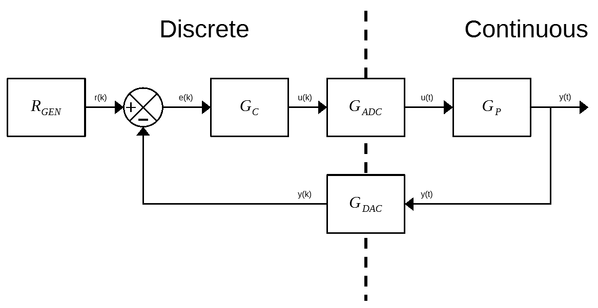
<p style="text-align: center;">Fig. 1 - System Block Diagram</p>

As can be seen by the usage of both ADC and DAC blocks, the controller will be designed in the discrete Z-Domain. The overall project for the PI controller was done in the steps identified below:
1. Description & Analysis of the Control System
2. Statement of the goal statistics for the Closed Loop System response in the S-Domain
3. Transformation of the SLIT System to the Z-Domain
4. Definition of the controller equation $G_c$ via the Root Locus Method
5. Implementation of the controller in QSPICE
6. Manual optimization of the controller

Initialy, the choosen problem was taken from the Youtube channel [CAN Education](https://www.youtube.com/@CanBijles), in the [Digital Control Design | PI Controller Design](https://www.youtube.com/watch?v=MogarqbRurI&list=PLuUNUe8EVqln8g-yPt_2ZEtjH8Faegm3S&index=2) video. Although this is far from being the only content on Youtube that has excelent control systems design lectures, it is able to reproduce step-by-step the design procedure and give quantitative data of the final results, which will be unvaluable to compare the designed system that is built here. Thus, if a more in depth approach into the mathematics is required, this channel is the reference.

With the introduction to the project done, let's delve ourselves into the initial design.

## 1. Control System Description & Analysis
As already mentioned in the introduction, the aim of this specific project is to evaluate the usage of the QSPICE simulator as a viable simulation platform for control systems simulation. Hence, the simulated plant will be (at least initially) a simple one pole stable system given by $G_P$:

$$ G_P = {1 \over (s+1)}$$

Additionally, the presence of the DAC will be accounted as a Zero-Order-Hold (ZOH) operator, wich will be accounted for mathematically in the discretization process of the target plant $G_P$ by the expression:

$$
    G_{DAC} = G_{ZOH} = {{1-e^{-sT}} \over {s}}
$$

Thus the final system that will be analysed is given in the figure below:

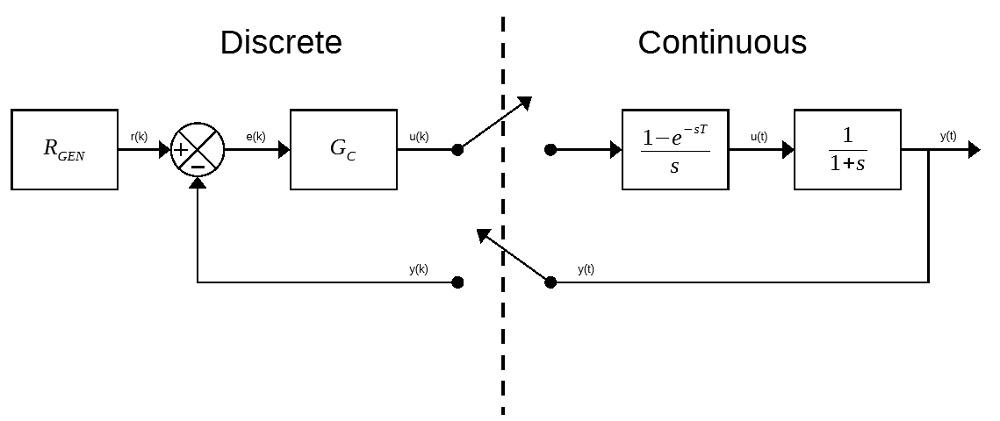
<p style="text-align: center;">Fig. 2 - System Block Diagram w\ Equations</p>

## 2. Key Controller Parameters
Another assumption that will be done is relative to the performance statistics of the closed loop system response. With the Root Locus Method in mind, the core performance metric shall be:

1. [$t_s(2\%)$   ] : Settling Time (2%) less than **24 seconds**  
2. [$e_{SS}$    ] : Steady-State error equal to **zero for a step input**

As stated by the title of this project, the discrete digital controller will be a PI controller, thus it is expected that it's characteristic equation is given by a proportional term $K_P$ and a integral term $K_I$ (which will be discussed later), thus, there is no need for more performance related values such as the Peak Overshoot value $M_p$ or the Rise Time $t_R$. 

The only other key parameter that needs to be disclosed is the sampling time $T_s$ which will be equal to 0.5 seconds in this initial example.

## 3. Sample-Hold & Plant Transfer Function
To be able to use de Root Locus Method of designning the discrete controller first, both the zero order hold and the target plant should have their transfer functions discretized. Let $G(s)$ be the union of the hold and plant transfer functions, then:
$$
G(s) = G_h(s) \cdot G_p(s) = {{1-e^{-sT_s}}\over{s}} \cdot {{1}\over{s+1}} = {(1-e^{-sT_s})} \cdot {{1}\over{s(s+1)}}
$$

with the help of pre-computed tables such as [this one](https://lpsa.swarthmore.edu/LaplaceZTable/LaplaceZFuncTable.html) the impulse Z-Transform of $G(s)$ can be determined as

$$
G(z)=\Zeta\{G(s)\}=\Zeta\{{(1-e^{-sT_s})} \cdot {{1}\over{s(s+1)}}\}=\Zeta\{{(1-e^{-sT_s})}\} \cdot \Zeta\{{{1}\over{s(s+1)}}\}
$$
$$
\therefore G(z)=(1-z^{-1}) \cdot {{(1-e^{-1 \cdot 0.5})z} \over {(z-1)\cdot(z-e^{-1 \cdot 0.5})}} = {{1-e^{-0.5}}\over{(z-e^{-0.5})}} \therefore G(z)={{0.3935} \over {z-0.6065}}
$$

## 4. Discrete Controller Design via Root Locus Method
It is know that in the Laplace Domain, the design point of the controller is given by $s_m=-\sigma_{d} + j\omega_d$. The two variables ($\sigma_d$ and $\omega_d$) can be determined via the goal performance metrics. The real part $\sigma_d$ can be solved using the specified settling time, where:

$$
    t_s(2\%) = {4 \over \sigma_d} \space \rightarrow \space \sigma_d = {1 \over 6} 
$$

While the imaginary part could be accounted for if the peak value or any other key performance metric is given, it is not the case for this example (again simplicity is best for preliminary tests) and thus, it's value will be zero:

$$
    \omega_d = 0 \therefore s_m = -{1 \over 6}
$$

To convert the design point from the S-Domain to the Z-Domain, we will use the exact transformation, defined as:

$$
    z = {e^{sT}} \therefore z_m = e^{s_mT_s} = e^{-{1 \over 6} \cdot {0.5}} \therefore z_m = 0.9200
$$

With the definition of the design point in the Z-Domain, the discrete controller can be designed by using the same method used in the continuous case. To start the design procedure, a Z transform of the standard PID ISA formulation is taken, resulting in the discrete PID controller form:

$$
    G_C(s) = {{U(s)}\over{E(s)}} = {{K_P}\cdot{(1+{1 \over T_Is}+{T_ds})}}
$$

numerous methods can be used to transform from S-to-Z plane with different characterics being implied into the resulting equations. Initially the backwards finite difference method was used due to it's simplicity. The backbone of this method is the comprehention that the derivative of a signal x with respect to time can be aproximated by the average of the backwards difference between two consecutive samples:

$$
    {{\partial} \over {\partial t}}x(t) \simeq {{x(t)-z(t-T_s)} \over {T_s}} \implies \Zeta\{{{\partial} \over {\partial t}}x(t)\} = sX(s) \simeq {1-z^{-1} \over T_s} \cdot \Zeta\{X(s)\}
$$

therefore, the PID controller can be expressed as:

$$
    {G_C(z)= \Zeta\{G_C(s)\}} = K_P + {{K_P \over T_I}\cdot {T_s \over 1-z^{-1}}} + {K_P \cdot T_d \cdot {1-z^{-1} \over T_s}} \implies G_C(z)=K_P + {{K_P \over T_I}\cdot {T_s z \over (z-1)}} + {(K_PT_d) \cdot {(z-1) \over T_sz}}
$$

As we are only interested in computing the PI controller for this given plant, the derivative terms can be null and the equation can be simplified to the following form

$$
    G_C(z)=K_1+K_2{T_sz \over z-1}
$$

To continue with our controller design via the root locus method, is will be helpfull to transform the PI controller expression into a more friendly pole/zero format.

$$
    G_C(z)={K \cdot {{z-z_i} \over {z-p_i}}}, \space where \space K = K_1 + K_2T_s \space, \space z_i={K_1 \over {K_1 + K_2T_s}} \space , \space p_i = 1
$$

As there are two unknown variables and only one equation available for the design, one of the two variables should be given a arbitrary value and the second variable could be then calculated by the root locus equation. As in the continuous controller, a good rule of thumb is to place the PI controller's zero near to it's pole, such that the negative phase contribution of the controller is insignificant. This approache is done in order to ensure that the steady state error is null (using the integrator action) and at the same time preserve the transient response parameters of the original system.

Let's assume an arbirary value is given to the controller's zero ($z_i=0.9$), then the root locus equation states that, the Loop Transfer Function should have unity gain and 180° phase lag so that the closed loop system can be stable. Thus:

$$
    1 + G_C(z)G_P(z) = 0 \therefore 1 + {K \cdot {{z-0.9} \over {z-1}}} \cdot {{0.3935} \over {z-0.6065}} = 0 \therefore K = -{{(z-1)(z-0.6065)} \over {0.3935 \cdot (z-0.9)}}
$$
$$
    K|_{z=z_m}=-{{(z_m-1)(z_m-0.6065)} \over {0.3935 \cdot (z_m-0.9)}}=-{{(0.92-1)(0.92-0.6065)} \over {0.3935 \cdot (0.92-0.9)}} \therefore |K|_{z=z_m}=3.187
$$

With all of the controller parameters calculated, the next step is its effective implementation within the QSPICE environment.

## 6. Controller Implementation & Testing

Although the implementation of the control law itself is fairly straight foward, this step is the most important to evaluate if the QSPICE environment can accurately reproduce the MATLAB/Simulink result. Most importantly, our aim at this point is to loosely determine if the simulator environment is stable. A [generic testbed](.\PI_Controller.qsch "PI_controller.qsch") was created within QSPICE to allow for easy user modifications and interactions as shown below.


<p style="text-align: center;">Fig. 3 -  Control System Top Level Schematic Diagram</p>

Each block in the schematic above is a separate hierarchical schematic or C++ block that will be further analyzed below.

### 6.1 Subtraction Block

This description is only for completelessness, although realy unnecessary, as it is realy simple. This hierarchical schematic is composed by a simple behavioral voltage source that computes the diference between its two inputs. 


<p style="text-align: center;">Fig. 4 -  Subtraction Block Schematic Diagram</p>

Most importantly, this block is only present for a complete block diagram like those common to textbooks. Functionally, this block's operation could be done within the controllers C++ code.

### 6.2 Discrete Controller Block

The discrete controller block is the most important block at this point and is a C++ code that will run in each iteration of the SPICE computing cycle. If left as is, this block could be approximated to a continuous time function from the SPICE point of view. Thus, for a better emulation of a true discrete controller, the CPU_CLK signal was added, simulating a RTOS task scheduling mechanism of some sort. This distinction is very important, because the key parameter for the simulation to be as accurate as the ones done by MATLAB/Simulink lies within the time that is taken and the order in which operations occur. This caveat will be more apparent in the discussion of the results.

```C++
    //// Controller Implementation ////
    // Initialize State variables for the system. This will prevend data leakage between stepping parameters
    if(time == 0)
    {
        OUT   = 0;
        aux   = 0;
        ek_1  = 0;
        uk_1  = 0;
        ek    = 0;
        uk    = 0;
    }
    if((CLK == 1 && clk_lastest == 0))
    {
        // Get input data
        ek    = IN;
        // Apply Control Law
        uk    = (pi)*uk_1 + (K)*ek - (K*zi)*ek_1; 
        // Update variables
        OUT   = uk  ;
        ek_1  = ek  ;
        uk_1  = uk  ;
    }
    // Update ADC internal clock
    clk_lastest = CLK;
```
The expression used for the control law that was implemented here can be derived by usage of the inverse Z transform, by which $\Zeta\{X(z) \cdot z^{-n}\}=x[(k-n)T_s]$: 

$$
    G_C(z)={{U(z)}\over{E(z)}}={K \cdot {{z-z_i} \over {z-p_i}}}={K \cdot {{1-z_iz^{-1}} \over {1-p_iz^{-1}}}} \therefore U(z) \cdot ({1-p_iz^{-1}}) = E(z) \cdot K \cdot ({1-z_iz^{-1}}) 
$$
$$
    U(z)-p_iU(z)z^{-1} = KE(z)-Kz_iE(z)z^{-1} \therefore u[kT_s] - p_i \cdot u[(k-1)T_s] = K \cdot e[kT_s] - Kz_i \cdot e[(k-1)T_s]
$$
$$
    u[kT_s]  = p_i \cdot u[(k-1)T_s] + K \cdot e[kT_s] - Kz_i \cdot e[(k-1)T_s]
$$

Note that before the controller law itself can be applied a reset block that depends uppon the internal "time" variable from the SPICE engine is called each time the "time" equals 0. This block, as the comments suggest, is key so that when stepping simulations are done, internal states/variables from the controller are reset together with all SPICE variables. 

### 6.3 ADC/DAC Block

Both the DAC and the ADC block are presented here as C++ blocks inside hierarchical schematic sheets. Within the realm of the sheet it self, various ADC/DAC characteristics can be added (**in other Github projects**) in the pursuit of better digital twins. Some examples include the usage of bipolar operation with variable voltage references, which in essence influence (directly or not) the analog reference usaed in the conversion phase; as well as more common ADC/DAC parameters such as Gain and Offset errors intrinsic to the conversion technology that is being used. Also, this type of block can be usefull for noise simulation within the discrete time operation of the controller, evaluating the controllers immunity to noise in it's measurement setup.


<p style="text-align: center;">Fig. 5 -  ADC/DAC Block Schematic Diagram</p>

In this initial example, both the ADC and DAC are ideal ones, in the sense that they present infinite common range and infinite resolution. This is done to achieve the exact same results as those present in MATLAB/Simulink simulations, with the added benefit that if one requires, one could tweak the simulations setting to be more in accordance with their selected ADC/DAC. In the final part of this project, some simulations with a range of values for both the common mode range and the resolution will be presented.

```C++
// Module evaluation code:
   // Calculate Core data
   QL    = ((2<<(RES-1)));          // Compute Quantization Levels
   LSB   = (VREF_P-VREF_M)/(QL);    // Compute LSB
   FSp   = VREF_P-LSB;              // Compute positive FS
   FSm   = VREF_M;                  // Compute negative FS
   FSR   = FSp-FSm;                 // Compute FSR
   a     = (FSp)/(FSp-GE*LSB);      // Compute Gain Error Term
   b     = a*(OE)*LSB;              // Compute Offset Error Term

   // Saturate Voltage Input
   if(IN > VREF_P){IN=VREF_P;}
   if(IN < VREF_M){IN=VREF_M;}

   // Apply DAC Linear Transfer Function
   _out = IN;

   // Saturate DAC Output
   if(_out > FSp){_out=FSp;}
   if(_out < FSm){_out=FSm;}

   // Perform Analog to Digital Conversion
   _out = (long)((_out-VREF_M)/(LSB));

   // Convert from Integer Value do double
   _out = (double)((_out*LSB)+VREF_M);

   // Update ADC output
   if((CLK == 1 && clk_lastest == 0)){OUT = _out;}

   // Update ADC internal clock
   clk_lastest = CLK;
```

As one's keen eye might reveal, this implementation of the ADC/DAC performs the usual A-to-D or D-to-A conversion with the caveat that both the output and the input are not only using double precision floats as their data type, but also both are refered to the positive and negative reference voltages.

This is not strictly necessary. One could "receive" as input a double floating point value (a analog voltage for example) and give out a integer value corresponding to the direct conversion from analog to digital values in the case of a ADC. This might better simulate a real ADC/DAC and might also be more beneficial for low end microcontrollers (such as your PICs and ATTinys) were memory is a unvaluable resource. But in this use case scenario, the conversion to integer results in some headaches in simulation, causing some discontinuities in t=0 and adding more complexity to the implementation. As already mentioned, both ADC and DAC blocks will be further developed in adjacent projects to this one, so for now the "simple" implementation it is, until these blocks are more robust.

### 6.4 Target Plant Block

In the target plant block, simple plants can be achieved via a voltage dependent voltage source and the built in Laplace functions. Simple SLIT functions can be easily achieved, but more complex systems involving delays and other non-linear functions are dificult. 


<p style="text-align: center;">Fig. 6 -  Target Plant Block Schematic Diagram</p>

## 5. Controller Performance Analysis and Manual Optimization
With all the blocks that compose the simulation explained in detail, let's move on to the results. Several batches of simulations were done to compare what should be expected by the "ideal" MATLAB/Simulink world and the "more realistic" QSPICE simulations.

The first simulation is a direct comparison of the MATLAB/Simulink results and the QSPICE results for the proposed target plant and controller settings. The overall performance of the Closed Loop System is not of importance itself, but rather it's accordance with MATLAB simulations.

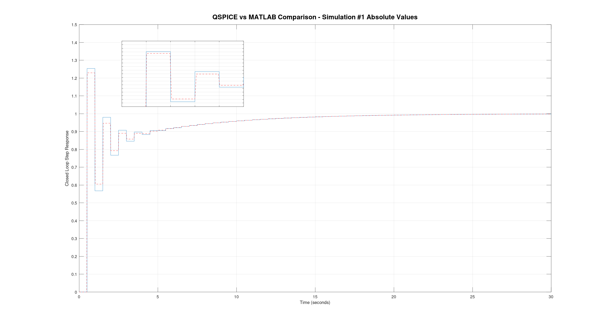
<p style="text-align: center;">Fig. 7 -  Simulation #1 MATLAB vs. QSPICE Results</p>

As can be seen in the figure above, although the simulation within QSPICE was successfully able to approximate the ideal MATLAB controller simulation, there were some differences regarding the numerical value of the response peak. 

As already has been pointed out, this behaviour is provenient from the delay between the ADC, CPU and DAC clocks, which in one hand are essential to ensure proper data flow, and in the other hand creates unnecessary delays in the controller. The increase of this interval leads to more delay in the controller and loss of some of it's specifications. 

In the other hand, although a decrease of this delay might increase the fidelity between the to simulations to some degree, after a arbitrary tipping point is passed the controller becomes unstable.

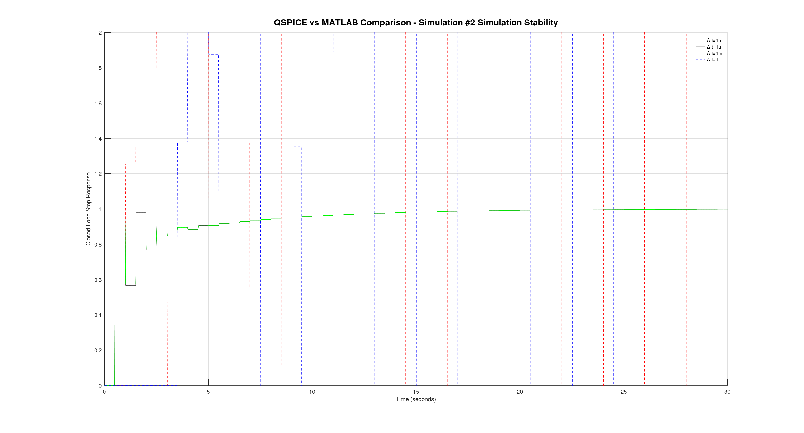
<p style="text-align: center;">Fig. 8 -  Simulation #2 MATLAB vs. QSPICE Simulation Stability</p>

In the example above, the stability of the system was tested with different delays between the digital components, ranging from a nanosecond to one second. As can be seen, both one microsecond and one millisecond produced stable results, while one nanosecond and one second were unstable.

As is it appears from this simulation, we can defer that although the control law itself is being correctly applied in all cases, on the extreme cases there is some interference. 

At the seconds range, the delay is in the same magnitude as the controller sampling frequency, and thus, it is obvious that it will introduce too much delay into the system, occasionally pushin the controller out of its stability region.

In the other hand, since the QSPICE engine has to integrate both SPICE and C++ solvers, there ought to be incompatibilities between both. One of such problems arises when SPICE has to perform the **Gaussian Elimination** algorithm to obtain voltages and currents from the circuit. This algorithm iteratively performs the nodal analisys of the system, but our C++ code can only be updated once (as would be expected from a real system).

Hence, due to this issue, a delay of sorts is added between the C++ code and the SPICE simulation. When all of the relevant data enters the C++ code and is treated within this context, there are no issues and no need for a "delay" between CPU, DAC and ADC. But when such blocks are separated, a "delay" is inserted between these elements in such manner that voltages from one element are not computed at the same time as the following element. If our controller/DAC/ADC code was executed at all time ticks of the simulation there would be no problem. 

Unfortunatelly that is not true, since we ourselves added code that would prevent such behaviour! To solve such issues the simple solution is to put all pieces of the control system within the C++ block, integrating ADC, CPU & DAC elements together as shown bellow:

```C++
    // Saturate Voltage Input
    if(IN > VREFP){IN=VREFP;}
    if(IN < VREFM){IN=VREFM;}

    // Initialize State variables for the system. This will prevend data leakage between stepping parameters
    if(time == 0)
    {
        OUT   = 0;
        aux   = 0;
        ek_1  = 0;
        uk_1  = 0;
        ek    = 0;
        uk    = 0;
    }

    //// Controller Implementation ////
    if((CLK == 1 && clk_lastest == 0))
    {
        // Get input data & apply internal ADC Linear Transfer Function
        yk    = IN*a+b;
        // Saturate ADC Output
        if(yk > FSp){yk=FSp;}
        if(yk < FSm){yk=FSm;}
        // Perform Analog to Digital Conversion
        yk    = (long)((yk-VREFM)/(LSB));
        // Convert from Digital to Analog approximation
        yk    = (double)((yk*LSB)+VEE);
        // Get reference data
        rk    = REF;
        // Calculate Error
        ek    = rk - yk;
        // Apply Control Law
        uk    = uk_1*pi + ek*K - ek_1*K*zi;
        // Update variables
        OUT   = uk;
        ek_1  = ek  ;
        uk_1  = uk  ;
    }
```


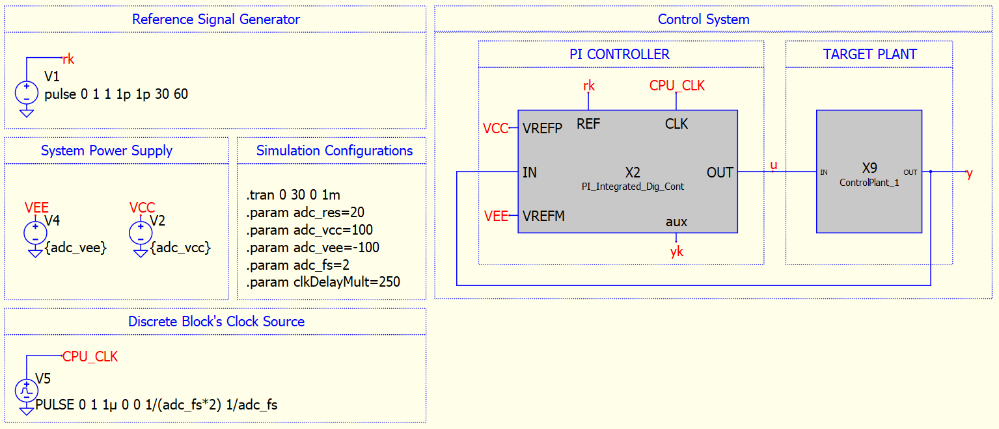
<p style="text-align: center;">Fig. 9 -  Integrated Controller Schematic</p>

Within the integrated controller, non-linear perturbations to the system could still be added through input/output ports while the system maintains it's stability. Thus, stability and reproductibility are secured at the cost of potential simulation accuracy with the real system (in which there are many cases where the there are delays between the ADC, CPU and DAC blocks). 

**Such stability vs. accuracy is to be further analised in other projects.** Here, the results of the integrated controller will be further analyzed. 

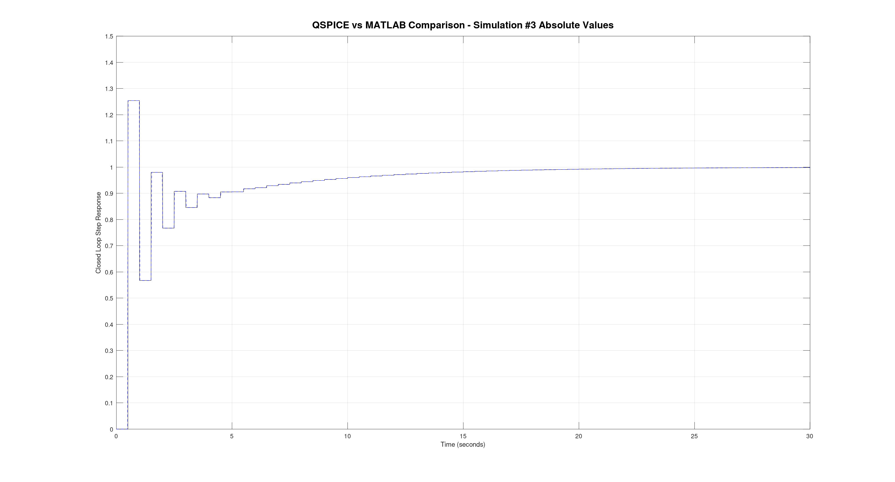
<p style="text-align: center;">Fig. 10 -  Simulation #3 MATLAB vs. QSPICE Absolute values</p>

As can be seen from figure 10, the usage of the integrated controller solves our numerical issues for this simulation.

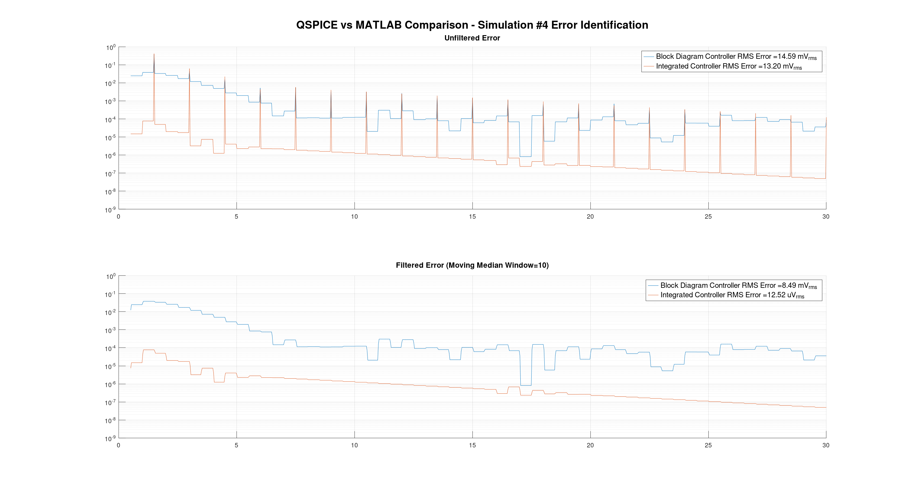
<p style="text-align: center;">Fig. 11 -  Simulation #4 MATLAB vs. QSPICE Errors</p>

Figure 11 puts into perspective the numerical differences between the performance of the two controller solutions. While a well tunned block diagram controller presents a 15 $mV_{RMS}$ error from the MATLAB simulation, the integrated controller error is three orders of magnitude lower, at 13 $\mu V_{RMS}$.

## 6. Beyond MATLAB
Here some key examples are shown to point out some advantages of the usage of QSPICE environment over MATLAB. Most of such examples arise from the generalist vs. specifist approach differences. MATLAB's approach to control systems is of a generic numerical control systems design platform, with numerous pre-built tools for analysis. 

QSPICE, in the other hand, presents itself as a numerical solver for hybrid electronic and logical systems. In one hand it is not as generic as MATLAB, and in the other hand, it is not as specific as LTSPICE or PSPICE as a SPICE solver. This "in between two roads" approach appears to be usefull in several cases, more specifically when electronic and simple logical systems meet eachother.

Here are some examples that may be somewhat tricky to implement in MATLAB but rather simple in QSPICE:

### 6.1. Quantization Error Effects

When designing the discrete controller dynamics are our most important parameter to be determined. This performance metric deppends exclusively of both ADC and DAC sampling rates. In many practical applications though, both ADC (input) and DAC (output) operational regions and characteristics should be considered.

In some situations, either the input signal or the output of the controller could reach a maximum value that is above the systems range of operation, leading to input or output saturation. For applications were the system requires steady-state accuracy over a wide range of values, ADC/DAC resolution could be a limiting factor. Furthermore, in some extreme precision cases, even ADC/DAC non-idealities, such as Gain/Offset Errors or DNL/INL Errors could be detrimental.

#### 6.1.1. Quantization Errors due to Limited Range

Until this point, the only parameter of interest was the systems output and it's error when compared to the MATLAB simulation. Here, let's take a look into the controller's output and it's limitations. 

If the controller parameters in Fig. 9 are analized it is apparent that a $V_{CC}$/$V_{EE}$ voltage of $\pm 100V$ is, at best, unrealistic. More common voltages such as $\pm 12V$ or $\pm 5V$ are used in practical systems to power analog electronics, and in turn, are also used for powering ADC's or DAC's references. 

In our example, the difference between the intended reference point and the input/output ranges are extreme (${V_{REF} \over V_{CC}} = {1 \over 100}$). If we lower the supply voltages to a more common value ($12V$) and the reference to $10V$, then it should be appearent that both the input common range and the output common range influence in our controller's response.

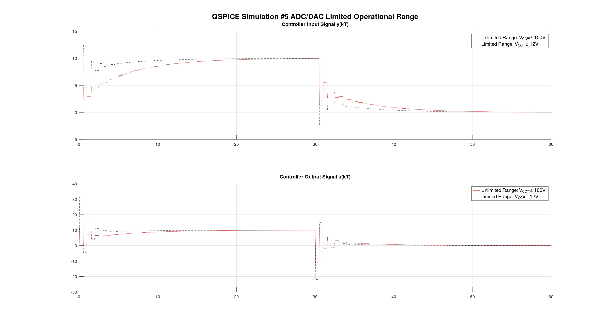
<p style="text-align: center;">Fig. 12 -  Simulation #5 ADC/DAC Limited Operational Range</p>

Here it can be seen that the effect of such physical limitations is the effective reduction of the systems rise time, and thus it's time constant. In the case of a inherently stable plant, this issue should not affect the controller's stability, as the saturation behaviour should decrease the impulse response.

In contrast, for plants that are inherently unstable and require a minimum controller impulse response to maintain the system's stability, the unaccounted appearance of a saturation behaviour might lead to unstability.

#### 6.1.2. Quantization Errors due to Limited Resolution
Another unavoidable error that is introduced in real systems is the quantization error in the A-to-D and D-to-A conversions. Quantization occurs due to the finite nature of digital codes that correspond to a virtually infinite number of real input/output values. In our previous examples the resolution was set to unrealistic values, such that the quantization error was too small to be accounted for. 

In practice, resolution is not the key parameter but rather the least significant bit (LSB), a combination of both the resolution and the effective full scale range (FSR) of the system. Either definition is simple, but no trivial as one might expect. LSB is defined **[source]** as the analog value corresponding to one digital code increment.

$$
LSB = {(V_{CC}-V_{EE}) \over 2^{RES}}
$$

In the other hand, the FSR is defined as the range of analog values that correspond to the full range of digital values, from 0 up to $(2^{RES}-1)$. Thus,

$$
FSR = (V_{CC}-V_{EE}) - 1 \cdot LSB
$$

Definitions asside, the effects of the quantization error in the controller can be verified by simply stepping the adc_res parameter in the simulation.

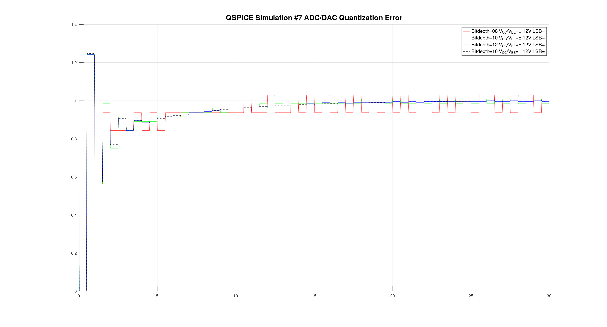
<p style="text-align: center;">Fig. 13 -  Simulation #7 ADC/DAC Quantization Error</p>

As can be seen, the introduction of a quantization error that is equal in both DAC and ADC leads to both a steady-state error, and a instability in the system caused by the controller's lack of precision while evaluating the current output of the plant and while injecting the control signal.

### 6.2. Power Supply Errors
Another possible source of errors to the system comes throughout the power supply lines. In all digital systems, the conversion from analog to digtal domains depend directly or not of the power supply levels. Here, two scenarios are analysized: Noise and Level perturbation, which essentially are the same physical phenomena but with substantially different causes. 

#### 6.2.1. Power Supply Noise
Although the term "Power Supply Noise" usually refers to the AC to DC conversion noise present in most power supplies (linear or switched), here our interest is not the causes of the power supply noise, but rather how does noise infiltrate our systems and how it could lead to potenttialy dangerous behaviour of the system.

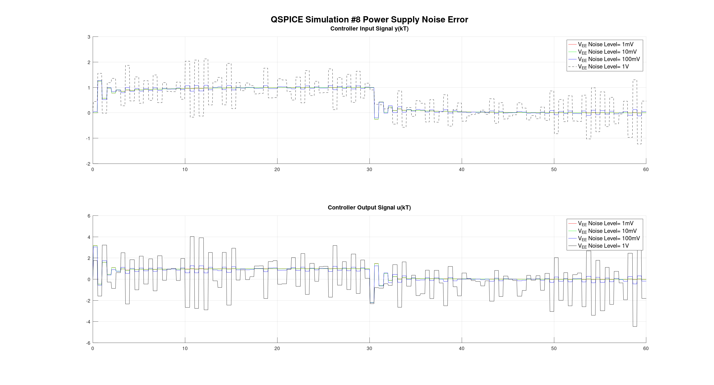
<p style="text-align: center;">Fig. 14 -  Simulation #8 Supply Noise Error</p>

As can be seen in figure 15, power supply noise directly infiltrates the ADC/DAC conversion stages, essentially adding the noise on top of our input/output signals. As might be expected, the effects of the noise are relatively greater when dealing with precision ADC/DAC, whoose improved resolution is essentially turned into garbage in noisy ambients.

Luckily, there is a great ammount of techniques that mitigate power supply noise, specially from mid to high frequency noise sources. Bypass Capacitors, LC Filters and even voltage regulators or voltage sources PSRR are some of the most common means to avoid noise injection in the signal of interest.

#### 6.2.2. Power Supply Perturbation
Another type of power supply error injection is done through low frequency perturbation. Electronic parameters are well known to alter their behaviour when subject to temperature, humidity, radiation exposure. Such interactions are slow by nature and can change, for example, the voltage delivered by a regulator or reference.

The effects in the input/output signal are the same as of the previous noise injection analysis. Thou here, there is little to do when the system is already exposed to such conditions. 

For ultra precision applications, all external parameters should be dealt with in order to assure that the system will meet nominal specifications. Examples of how to deal with some of those perturbation sources is automatic heating/coolig; hermetic sealing; radiation sealing; RF shielding, etc. 

(**Cook up example in which temperature affects a ADC/DAC regulator**)

### 6.3. Microprocessor Clock Errors
Other category of errors that could arise in a practical controller design and might be simpler to simulate in QSPICE than MATLAB is related to the controllers clock. A microprocessors clock is it's main (although not the only alternative) source for counting up time. This is usually achieved through a quartz crystal source tunned for a desired frequency. 

#### 6.3.1. Clock Frequency Shift
Unfortunately, clock frequency, specially in non-ovenized clock sources, is very prone to perturbances and frequency shifts. Such shifts are usually in the order of per cent (0.01) or parts per million (0.000001) and are too small to be of any concern in most low speed applications. For high speed applications or bery unstable systems, this might be an issue to be dealt with.

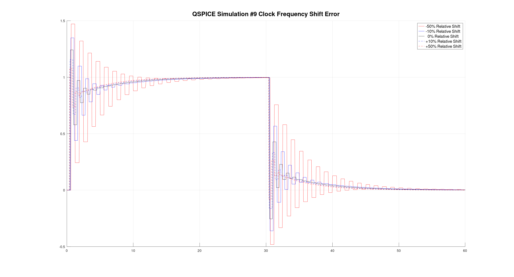
<p style="text-align: center;">Fig. 15 -  Simulation #9 Clock Frequency Shift Errors</p>

As can be seen in figure 16, for our system, shifts in the order of $\pm 20\%$ are tolerable and only affect the closed loop rise time. For clocks out of this range, some instability is encountered and might render our controller design useless. 

#### 6.3.2. Clock Jitter
Another type of clock related error that might be encoutered is jitter, which refers to the variation of clock phase throughout time. This error could arise from multiple sources, but most commonly it appears due to phase noise in clock sources (specially those with internal PLL's). 

To simulate the effects of this error source, one may use behavioral voltages in which a sine wave has it's phase parameter randomized throughout time.

```matlab
V=if((sin(2*pi*adc_fs*time + 2*pi*random(2e6*time)*jitter_mult) + 1) / 2, 1, 0)
```

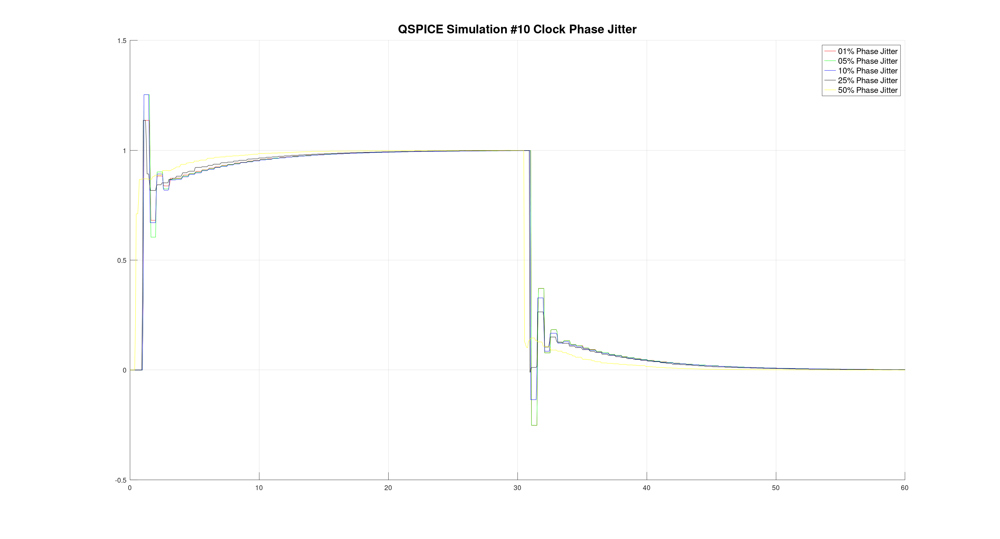
<p style="text-align: center;">Fig. 16 -  Simulation #10 Clock Jitter Errors</p>

Figure 17 depicts the controller's performance when there is 1%, 5%, 10%, 25% and 50% of clock jitter. Thou the overall performance of this specific controller might be unaffected, for high speed and cases were the plant is unstable, this might not be true.

## 7. Conclusion

In Section 6, many (simple and clearly cooked up) examples were shown to point out that in some occasions, the usage of the MATLAB control design environment could be accompanied by QSPICE simulations that could better depict the systems dynamics. In some cases, it might be faster and more intuitive to use a SPICE enabled simulator to complement the control design phase with a electronics engineering point of view.

Finally we point out that although the usage of separate blocks for DAC, ADC and CPU might lead to some unstable situations due to the manner in which SPICE calculations are done, the usage of a integrated controller solves our stability issues and delivers a controller that is identical as the one synthesized in MATLAB.

In **this** project, the design flow of a PI controller within QSPICE was validated, but there are many control algorithms that might produce controller's that can't be synthesized in the SPICE environment. This serves not only as a precautionary warning, but also as a **follow up** to this project.